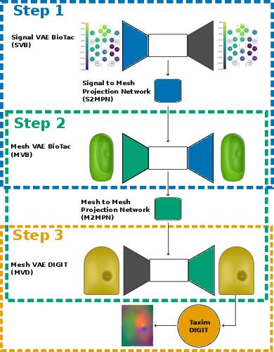

# The Official PyTorch Implementation of "ACROSS: A Deformation-Based Cross-Modal Representation for Robotic Tactile Perception" [(ICRA 2025)](https://arxiv.org/abs/2411.08533)

<div align="center">
  <a href="https://wzaielamri.github.io" target="_blank">Wadhah&nbsp;Zai&nbsp;El&nbsp;Amri</a> &emsp; <b>&middot;</b> &emsp;
  <a href="https://www.linkedin.com/in/malte-kuhlmann/" target="_blank">Malte&nbsp;Kuhlmann</a> &emsp; <b>&middot;</b> &emsp;
  <a href="https://nicolas-navarro-guerrero.github.io" target="_blank">Nicolás&nbsp;Navarro-Guerrero
</a> 
</div>
<br>
<br>


### Accepted to 2025 IEEE Conference on Robotics and Automation (ICRA 2025)
### Paper page can be found [here](https://wzaielamri.github.io/publication/across).


# DIGIT BioTac Isaac Gym.

This package contains the code for the BioTac to Digit pipeline. It allows to convert BioTac Signal into Digit Images.




The Figure above describes the steps of the pipeline which is contained in this repository. 
The pipeline delivers results similar to the image below


To train the pipeline yourself the networks can be split in three phases:

##### Phase 1:

In this phase the network **SVB**, **MVB** and **MVD** are trained. The code for that can be found 
in `BioTac_Signal_Reconstruction` and `Mesh_Reconstruction`.

##### Phase 2:
In this phase the translation networks **S2MPN** and **M2MPN** can be trained as the build upon the networks of phase 1.
The code for that can be found in `across/BioTac_Signal_to_Deformation` and `across/BioTac_to_DIGIT_Deformation`.

##### Phase 3:

This phase contains the Digit Image generation and does not need to be trained. The code for this can be found 
in `DIGIT_Simulation`.

## Installation

### Pipeline

To train and execute the BioTac to Digit pipeline follow these steps for installation:
1. `Optional but Recommended` Create a conda environment using `conda create -n pipeline python=3.10.14` 
2. Install all required packages using `pip install -e .[pipeline]`


## Citation

```
@InProceedings{zai2025across,
author="Zai El Amri, Wadhah
and Malte Kuhlmann
and Nicolás Navarro-Guerrero,
title="ACROSS: A Deformation-Based Cross-Modal Representation for Robotic Tactile Perception.",
booktitle="IEEE International Conference on Robotics and Automation (ICRA)",
year="2025",
}
```